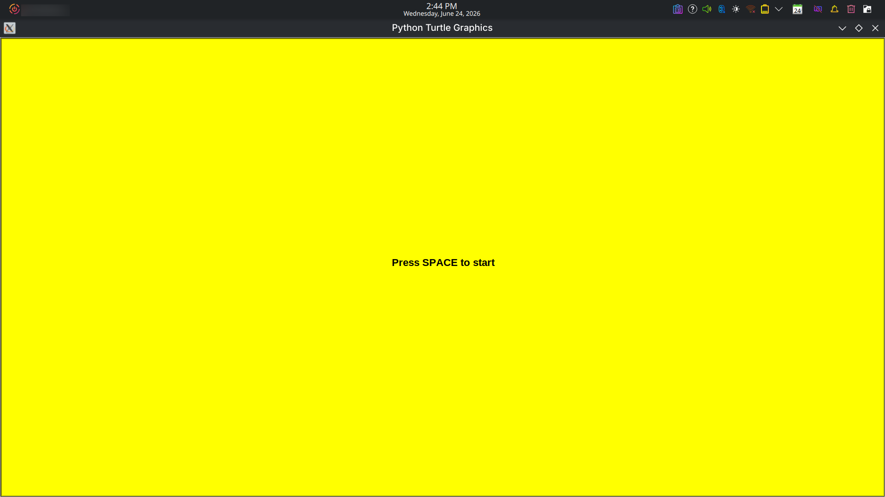
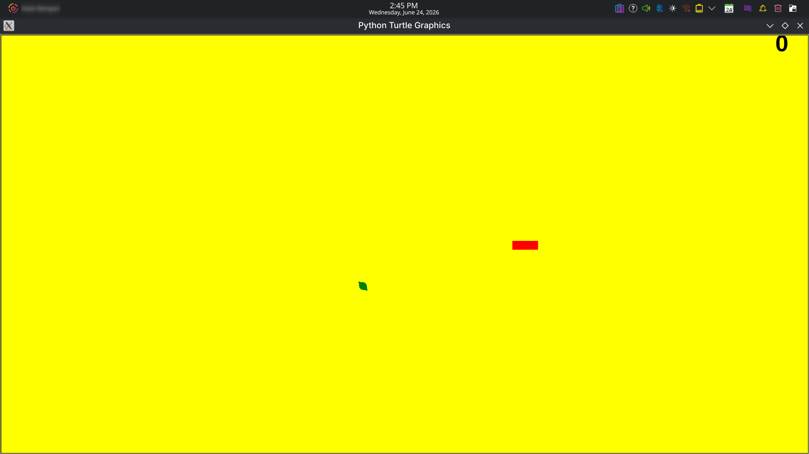

# Hungry Caterpillar 🐛
In this computer game, the user controls the caterpillar's direction with the arrows on the keyboard. Goal is to collect all the leaves to get points.

# Installation (Linux & Mac)
Download the latest release to your `Downloads` folder

Open the terminal and navigate to your `Downloads`

Run `python3 caterpillar.py` to start the app
# Installation (Windows)
Download the latest release to your `Downloads` folder

Double clicking on the file should start the app
